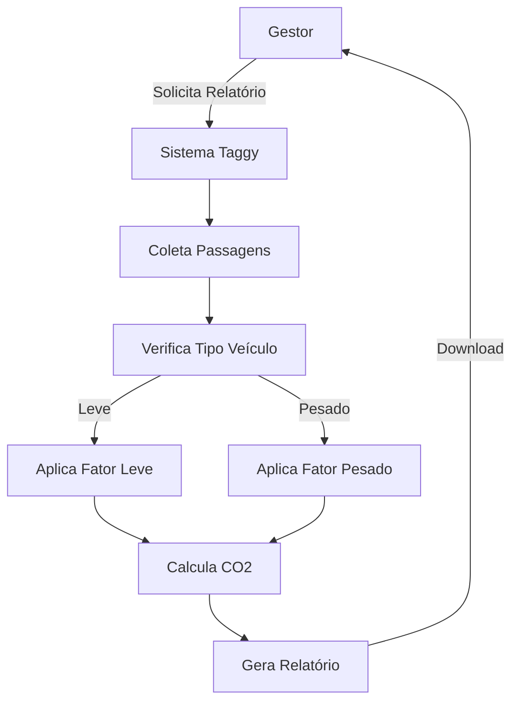
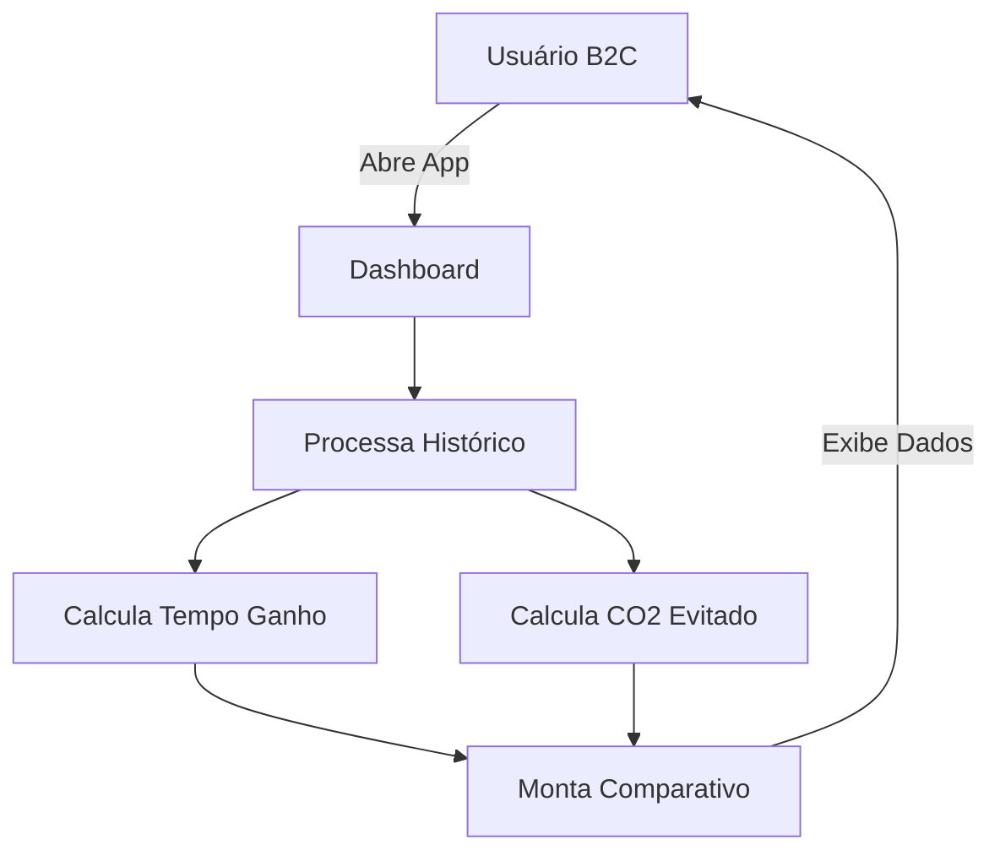
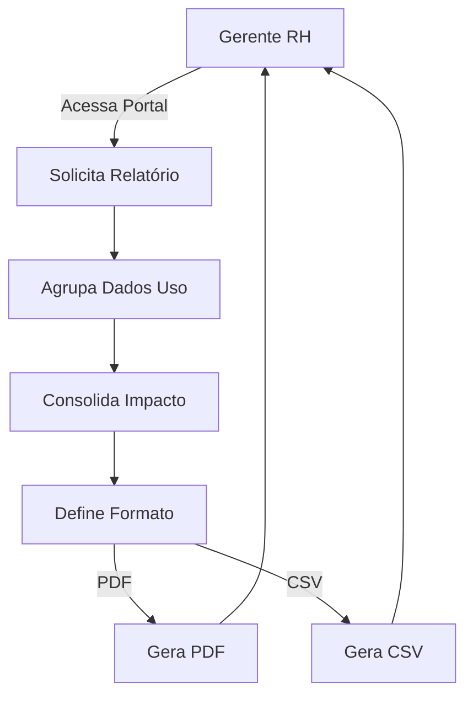
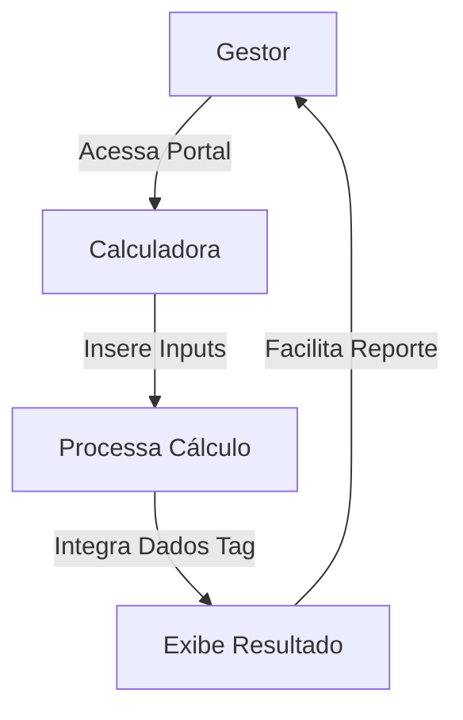
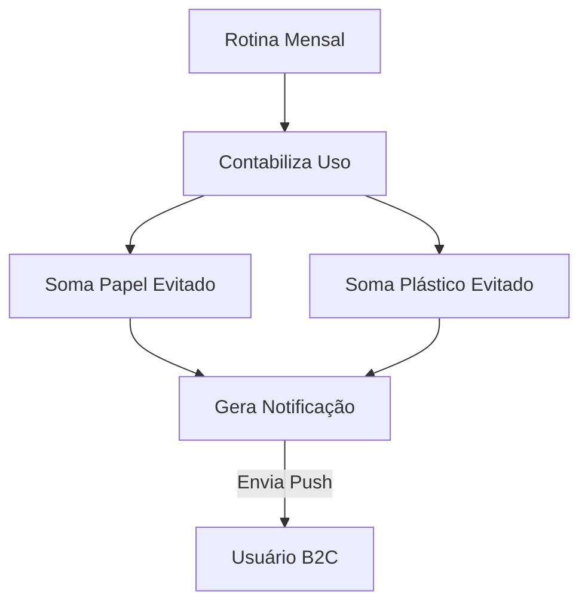
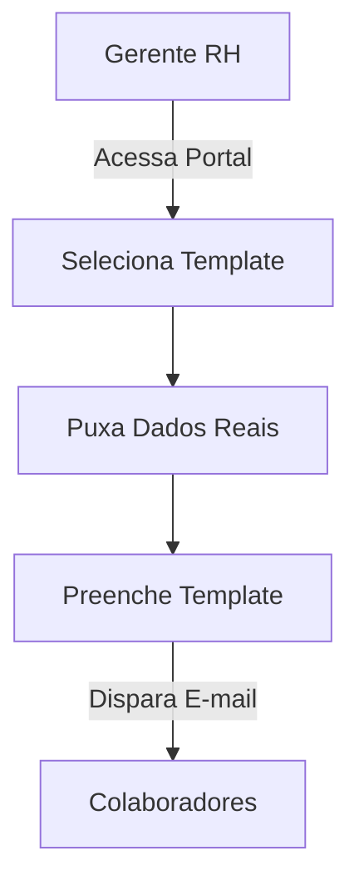
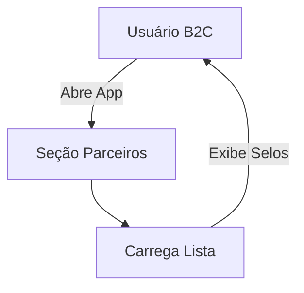
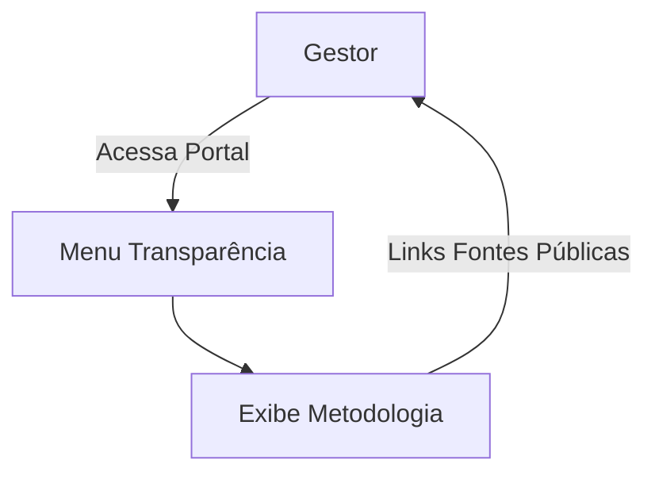
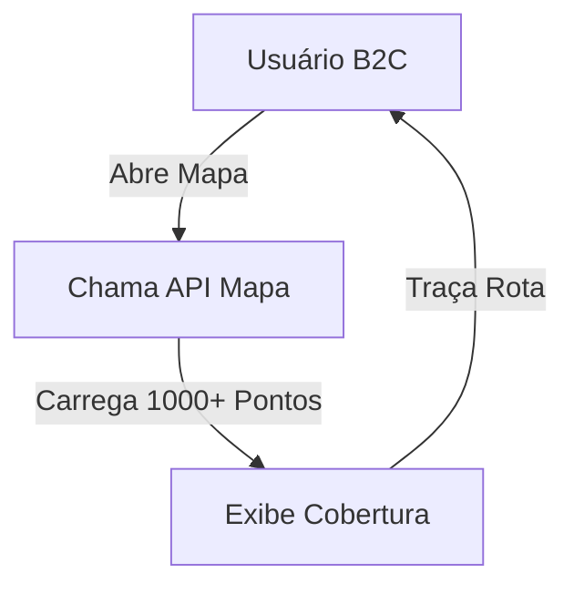
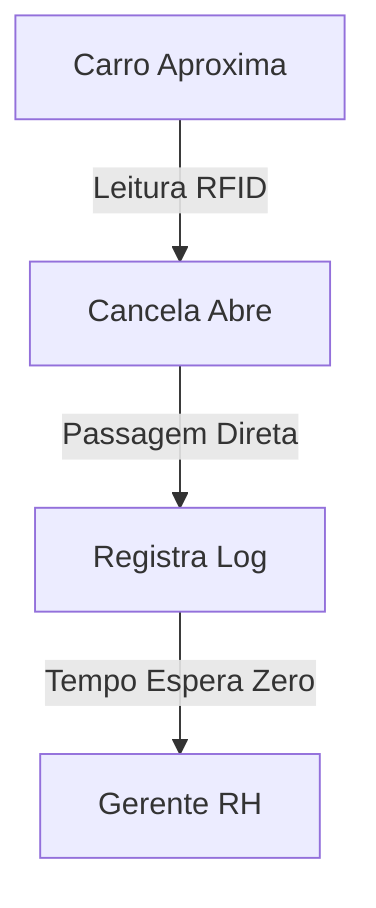

# Taggy Green

> Print do Trello.

### Ajustes e melhorias

O projeto ainda está em desenvolvimento e as próximas atualizações serão voltadas para as seguintes tarefas:

- [x] Definição das User Stories (Padrão 3Cs)
- [x] Priorização do Backlog (Alta, Média, Baixa)
- [ ] Implementação do motor de cálculo de CO2 (Fatores oficiais)
- [ ] Desenvolvimento do Dashboard B2C (Tempo ganho vs. CO2)
- [ ] Exportação de relatórios PDF/CSV para gestão de RH

## 📋 Histórias de Usuário (Backlog)
Legenda de Prioridades:

🔴 Vermelho: Alta Prioridade (Essential/Core)

🟡 Amarelo: Média Prioridade (Growth/Engagement)

🟢 Verde: Baixa Prioridade (Value-Add/Optimization)

##

### 🔴 ID 01: Conversor de Carbono B2B

> **User Story:** Como Gestor de Sustentabilidade, quero converter passagens de pedágio em dados de CO2​ evitados, para gerar relatórios auditáveis.

### 🔴 ID 02: Dashboard de Impacto B2C

> **User Story:** Como usuário B2C, quero visualizar o impacto ambiental positivo das minhas viagens no app, para sentir que minha conveniência contribui para o planeta.

### 🔴 ID 03: Relatório de ROI Ambiental

> **User Story:** Como Gerente de RH, quero um relatório de sustentabilidade da frota/benefícios, para justificar o ROI ambiental do serviço para a diretoria.

### 🟡 ID 04: Calculadora Parametrizada

> **User Story:** Como Gestor de Sustentabilidade, quero uma calculadora parametrizada no portal, para facilitar meu trabalho de reporte mensal.

### 🟡 ID 05: Notificações "Zero Papel"

> **User Story:** Como usuário B2C, quero receber notificações sobre a redução de uso de plástico e papel (tags vs. tickets), para validar meu desejo de ser "mais sustentável".

### 🟡 ID 06: Kit de Endomarketing ESG

> **User Story:** Como Gerente de RH, quero comunicar a redução de poluentes aos colaboradores, para aumentar a satisfação e retenção com o benefício.

### 🟡 ID 07: Rede de Parceiros Verdes

> **User Story:** Como usuário B2C, quero que o app mostre selos de sustentabilidade parceiros, para consumir de marcas que compartilham meus valores.

### 🟢 ID 08: Portal de Transparência

> **User Story:** Como Gestor de Sustentabilidade, quero acesso a metodologias baseadas em dados públicos, para garantir que os cálculos não sejam questionados.

### 🟢 ID 09: Mapa de Cobertura Total

> **User Story:** Como usuário B2C, quero integrar minha Taggy a 1.000+ estacionamentos e shoppings, para otimizar meu tempo no dia a dia.

### 🟢 ID 10: Fluxo Contínuo RFID

> **User Story:** Como Gerente de RH, quero uma solução que simplifique a locomoção (RFID), para eliminar filas e estresse para os funcionários.

## 🤝 Participantes

Agradecemos às seguintes pessoas que contribuíram para este projeto:

<table>
  <tr>
    <td align="center">
      <a href="https://github.com/RenatoCamara99" title="Github do integrante">
         
        
          <b>Renato Câmara</b>
        
      </a>
    </td>
    <td align="center">
      <a href="https://github.com/joaofdurao" title="Github do integrante">
         
        
          <b>João Durão</b>
        
      </a>
    </td>
    <td align="center">
      <a href="https://github.com/Henrique-Veloso" title="Github do integrante">
         
        
          <b>Henrique Veloso</b>
        
      </a>
    </td>
    <td align="center">
      <a href="https://github.com/caiqueassuncao" title="Github do integrante">
         
        
          <b>Caique Assunção</b>
        
      </a>
    </td>
    <td align="center">
      <a href="https://github.com/phbag-bit" title="Github do integrante">
         
        
          <b>Pedro Barreiras</b>
        
      </a>
    </td>
        <td align="center">
      <a href="https://github.com/FelixCavalcanti" title="Github do integrante">
         
        
          <b>Luis Felix</b>
        
      </a>
    </td>
    <td align="center">
      <a href="https://github.com/aabsm-cesar" title="Github do integrante">
         
        
          <b>Antonio Sandes</b>
        
      </a>
    </td>
  </tr>
  <tr>
    <td align="center">
      
        BACKEND
      
    </td>
    <td align="center">
      
        SCRUM MASTER
      
    </td>
    <td align="center">
      
        PO
      
    </td>
    <td align="center">
      
        FRONTEND
      
    </td>
    <td align="center">
      
        BACKEND
      
    </td>
    <td align="center">
      
        FRONTEND
      
    </td>
    <td align="center">
      
        DB
      
    </td>
  </tr>
</table>
